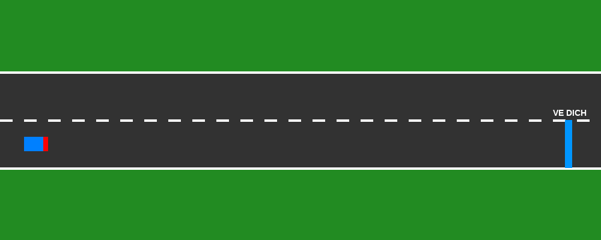
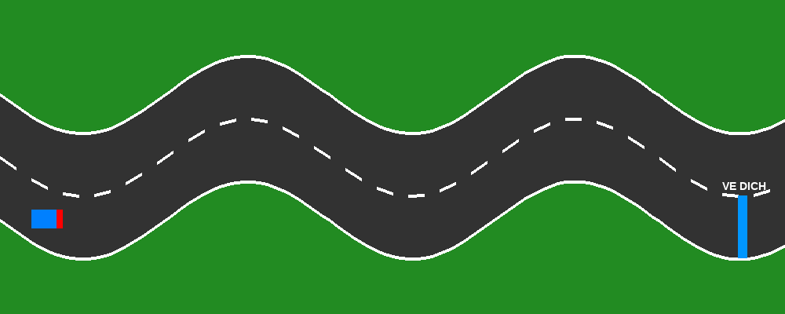

# 🚗 2D Autonomous Lane Following via Tabular Q-Learning

  

---

## 🎯 1. Phát biểu Bài toán (Problem Statement)

Bài toán đặt ra là thiết kế hệ thống hỗ trợ giữ làn đường (Lane Keeping System - LKS) cho xe tự hành trong môi trường mô phỏng 2D ($1000 \times 400$ pixels). 

Mục tiêu của tác nhân (xe) là tự điều khiển hướng ngang để di chuyển từ đầu đường (bên trái) về đích (bên phải) trên các dạng quỹ đạo khác nhau (đường thẳng và đường cong Sin) mà **không được đâm lề** hoặc **đi lệch khỏi làn đường chỉ định**.

---

## 📸 Môi trường Mô phỏng

| Map 1: Đường thẳng (Straight Track) | Map 2: Đường cong Sin (Sinusoidal Track) |
| :---: | :---: |
|  |  |

---

## 💡 2. Cách làm & Phương pháp Giải quyết (Methodology)

Bài toán được mô hình hóa theo dạng **Markov Decision Process (MDP)** và giải quyết bằng thuật toán **Tabular Q-Learning**:

* **Rời rạc hóa Trạng thái (State Space):** Sai số khoảng cách ngang $d_t$ giữa xe và tâm làn đường (trong khoảng $[-40, 40]$ pixels) được chia thành **10 vùng rời rạc (state bins)** từ $0$ đến $9$.
* **Không gian Hành động (Action Space):** Gồm 3 lệnh điều khiển hướng ngang rời rạc:
  * $a_0$: Di chuyển lên / Chuyển trái ($\Delta y = -2$ px)
  * $a_1$: Giữ nguyên vị trí ($\Delta y = 0$ px)
  * $a_2$: Di chuyển xuống / Chuyển phải ($\Delta y = +2$ px)
* **Định hình Phần thưởng (Reward Shaping):**
  * **Chạy đúng làn:** Thưởng điểm dương tăng dần khi sai số $d_t \to 0$ (tối đa $+11$ điểm/bước).
  * **Đâm lề (Thất bại):** Phạt hố $-100$ điểm và kết thúc episode.
  * **Về đích (Thành công):** Thưởng lớn $+200$ điểm.
* **Chiến lược Học:** Sử dụng Bảng Q Matrix ($10 \times 3$) kết hợp chiến lược khám phá $\epsilon$-greedy suy giảm theo thời gian ($\epsilon$ giảm từ $0.6$ xuống $0.01$).

---

## 📊 3. Kết quả Đạt được (Results)

| Bản đồ | Loại đường | Episode Hội tụ | Tỷ lệ Về đích | Phần thưởng Tối đa |
| :--- | :--- | :---: | :---: | :---: |
| **Map 1** | Đường thẳng | ~40 | **100%** | **3390.5** |
| **Map 2** | Đường cong Sin | ~110 | **100%** | **2712.5** |

> **Nhận xét:** Tác nhân học thành công chính sách giữ làn tối ưu trên cả 2 bản đồ. Ở đường cong Sin, xe xuất hiện hiện tượng vọt lố nhẹ (overshoot) do giới hạn của bước di chuyển rời rạc ($\Delta y = \pm 2$ px) tại các đỉnh đường cong có độ uốn lớn.

---

## 📄 License
This project is open-source under the [MIT License](LICENSE).
